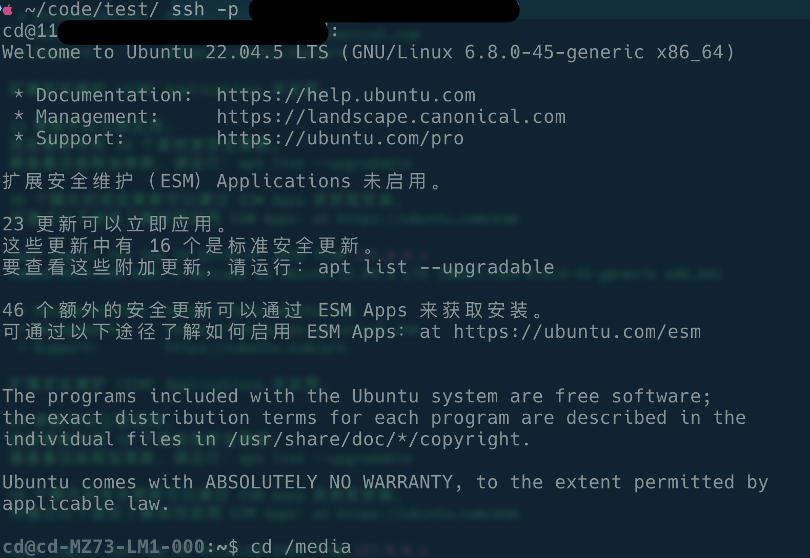
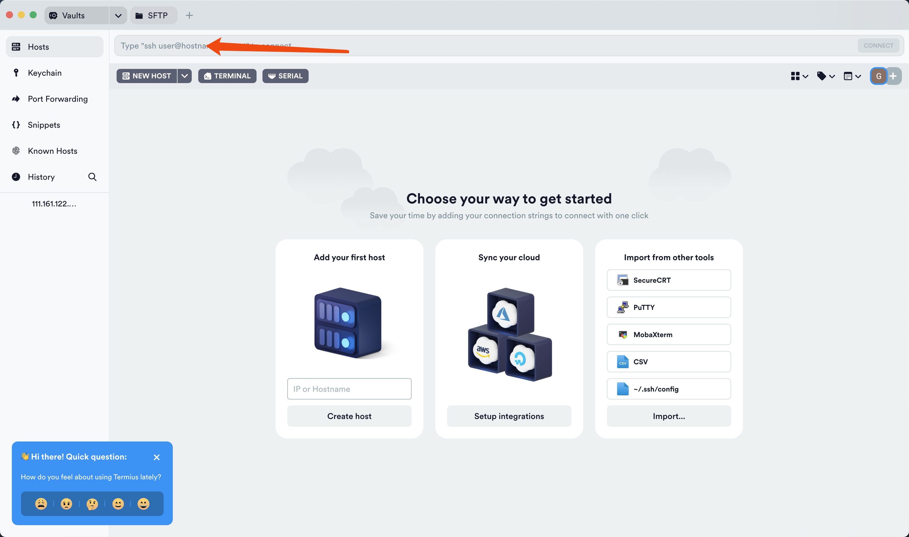
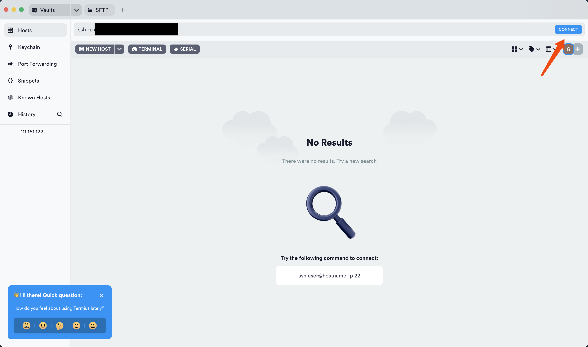
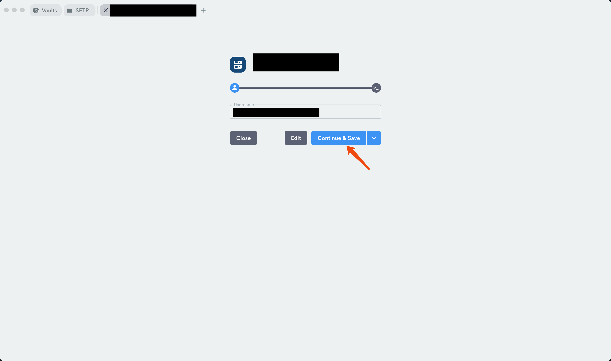
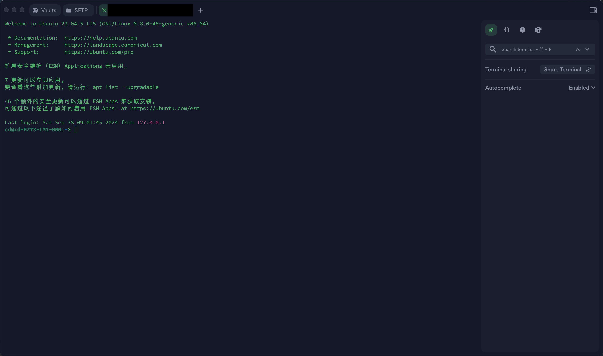
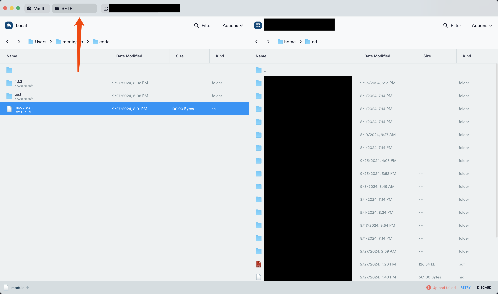

# SSH访问服务器、SFTP与服务器进行文件传输使用文档（macOS,iPadOS,iOS)
## 为了解决的问题
现在课题组的服务器远程连接大多采用商业远程控制软件，如：todesk、向日葵等，采用这些软件所存在的问题：
- 因为只有一套操作页面，无法满足多人同时操作；有些同学的操作不需要界面，通过命令行就可以完成操作，但也要等前面的同学使用完毕。
- 商业软件因为带宽限制低，传输操作页面本身就需要占用很大的带宽，从而出现远程传输文件速度慢，以及由网速慢导致的键盘粘滞的情况。

## 实现原理以及具体配置方法
- 实现原理：SSH-SFTP + 内网穿透
- 本地配置：
    - 终端访问（仅能SSH链接，不能使用SFTP传输文件）：需要安装openssh-client程序
    ```
    win：https://docs.sunfounder.com/projects/picar-x/zh/latest/appendix/install_openssh_powershell.html
    mac、ubuntu自带ssh客户端可直接使用
    ```
    - SSH-SFTP客户端访问（既可以SSH链接、也可以传输文件）：需要安装SSH-SFTP集成客户端软件
    ```
    win:见另一文档
    macOS,iPadOS,iOS:推荐使用termius软件（https://termius.com/）  
    Termius软件的PRO功能可通过注册Github Education解锁
    （https://education.github.com/discount_requests/application）
    ```
- 服务器端配置：见另一文档
## SSH终端访问
如果无传输文件的需求，可直接通过电脑终端直接访问
```
因为进行了内网穿透，只能通过具体端口访问
步骤：
step1: ssh -p 端口号 用户名@公网ip(正常使用IP和端口不变，若内网穿透的隧道改变，IP和端口为发生改变)
step2: 输入该用户密码（密码不会显示）
Bingo！
```
结果图



## SSH-SFTP客户端访问（以Termius为例）
### SSH访问




### SFTP传输文件

